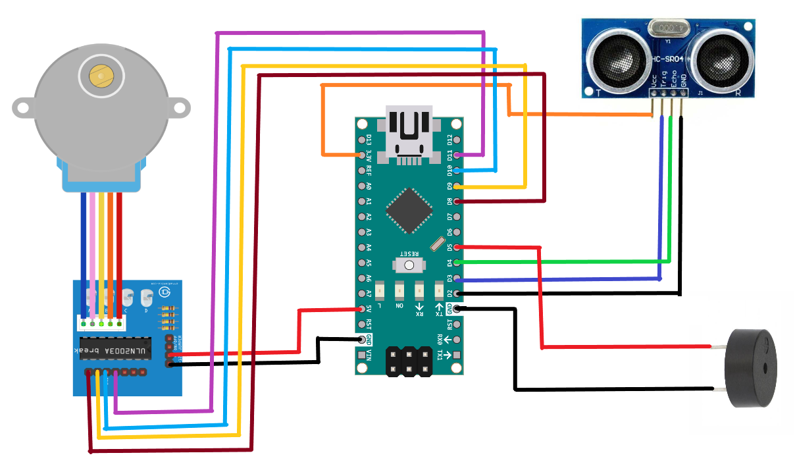
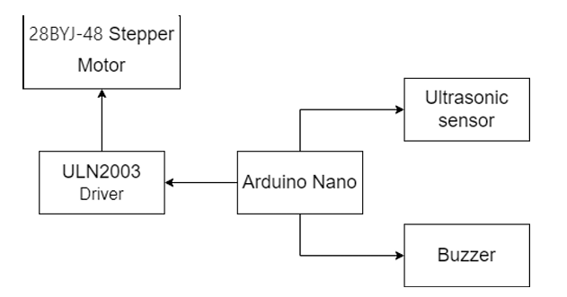

# Arduino Nano – Ultrasonic Pest Deterrent

## Overview
This module uses:
- **Arduino Nano**
- **Ultrasonic Sensor (HC-SR04)**
- **28BYJ-48 Stepper Motor** with ULN2003 driver
- **Buzzer** for pest deterrence

The ultrasonic sensor rotates **180°** using the stepper motor. If an object (pest) is detected, the buzzer emits a **31 kHz** ultrasonic sound to repel it.

---

## Pin Connections

| Component               | Arduino Nano Pin | Notes                                |
|-------------------------|------------------|--------------------------------------|
| Ultrasonic Sensor VCC   | 5V               | Power supply                         |
| Ultrasonic Sensor GND   | GND              | Common ground                        |
| Ultrasonic Sensor Trigger| D3               | Sends ultrasonic pulse               |
| Ultrasonic Sensor Echo  | D4               | Receives pulse                       |
| Stepper Motor IN1       | D8               | ULN2003 driver input                  |
| Stepper Motor IN2       | D9               | ULN2003 driver input                  |
| Stepper Motor IN3       | D10              | ULN2003 driver input                  |
| Stepper Motor IN4       | D11              | ULN2003 driver input                  |
| Buzzer                  | D5               | Pest deterrent sound output           |
| pinToGround             | D2               | Connected to GND in setup             |

---

## Required Libraries
- **AccelStepper** or built-in `Stepper.h`

---

## Upload Instructions
1. Open `PestDeterrent.ino` in Arduino IDE.
2. Select **Board**: `Arduino Nano`.
3. Select **Processor**: `ATmega328P (Old Bootloader)` (if needed).
4. Select COM port.
5. Click **Upload**.

---

## ⚙️ Code Parameters
- Distance threshold is set to `20 cm`:
  ```cpp
  int threshold = 20;

---

## Reference
See `/hardware/schematics/deterrent_system_pin_diagram.png` for Pin diagram.

<p align="center">
  
</p>

See `/hardware/schematics/deterrent_system_block_diagram.png` for Block diagram.

<p align="center">
  
</p>

<p align="left">
  <em>Click here to watch the video</em><br>
  <a href="https://youtu.be/fsNpkMCs-mo?si=y1ROI62KzJmzYFPI">
    ▶ Watch Video
  </a>
</p>