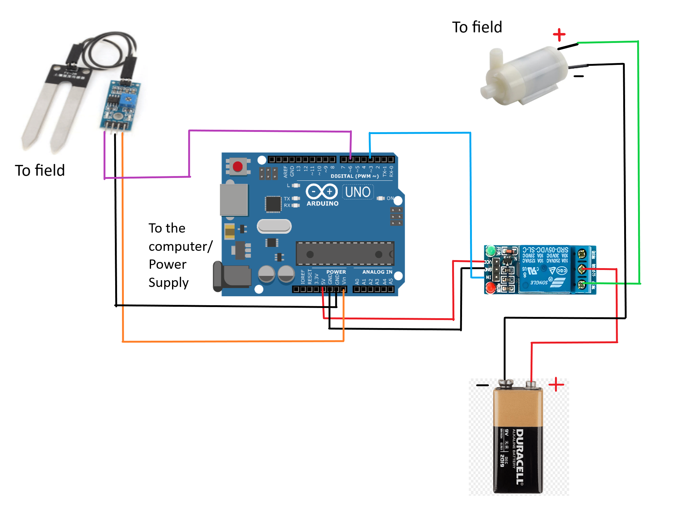
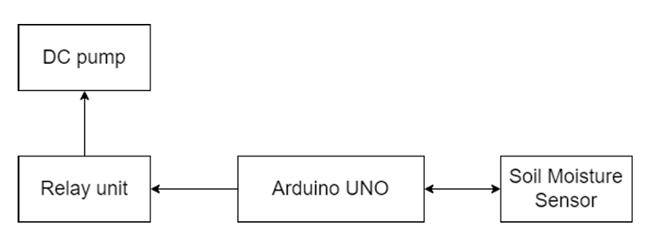

# Arduino UNO – Irrigation System

## Overview
This module controls the **automated irrigation system** using:
- **Arduino UNO**
- **Soil Moisture Sensor** to measure soil water content
- **Relay Module** to switch the DC Pump
- **5V DC Pump** to water the plants

The system turns on the pump when soil moisture falls below **70%** and turns it off when the threshold is reached.

---

## Pin Connections

| Component                  | Arduino UNO Pin | Notes                              |
|----------------------------|-----------------|------------------------------------|
| Soil Moisture Sensor (AO)  | A0              | Analog moisture reading            |
| Relay Module (IN)          | D3              | Controls pump power                |
| Pump                       | Via Relay       | Powered externally via relay       |
| VCC (Sensors)              | 5V              | From UNO                           |
| GND (Sensors)              | GND             | Common ground                      |

---

## Required Libraries
- None (uses basic Arduino functions)

---

## Upload Instructions
1. Open `IrrigationSystem.ino` in Arduino IDE.
2. Select **Board**: `Arduino Uno`.
3. Select the correct COM port.
4. Click **Upload**.

---

## ⚙️ Code Parameters
- Moisture threshold is set to `500` in the code:  
  ```cpp
  const int threshold = 500;

## Testing
- Insert the moisture sensor into soil.

- If dry → pump turns on.

- If wet → pump turns off.

## Reference
See `/hardware/schematics/irrigation_system_pin_diagram.png` for Pin diagram.

<p align="center">
  
</p>

See `/hardware/schematics/irrigation_system_block_diagram.png` for Block diagram.

<p align="center">
  
</p>

<p align="left">
  <em>Click here to watch the video</em><br>
  <a href="https://drive.google.com/file/d/101oT1utbdnvS9miWInwamOtJH0uGrsT2/view?usp=drivesdk">
    ▶ Watch Video
  </a>
</p>