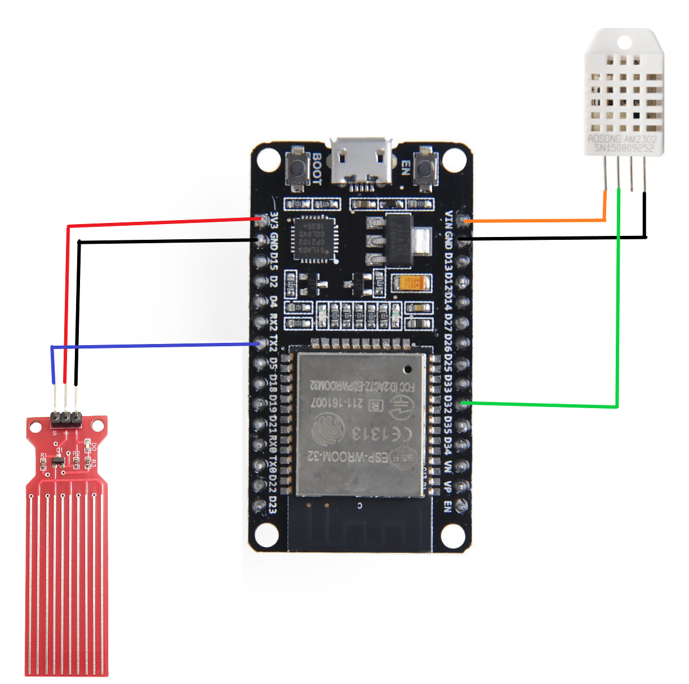
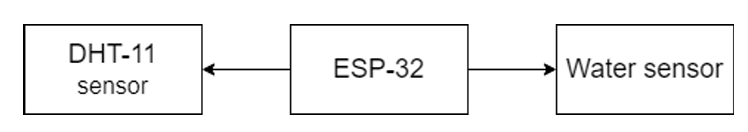

# ESP-32 – Blynk Monitoring

## Overview
This module connects the **ESP-32** to the Blynk app to display:
- **Temperature** (DHT-11 sensor)
- **Humidity** (DHT-11 sensor)
- **Water level** (Water level sensor)

It sends real-time data to the Blynk app and triggers alerts when thresholds are crossed.

---

## Pin Connections

| Component              | ESP32 Pin | Notes                                   |
|------------------------|-----------|-----------------------------------------|
| DHT11 Data             | GPIO27    | Reads temperature and humidity          |
| DHT11 VCC              | 3.3V      | Power                                   |
| DHT11 GND              | GND       | Ground                                  |
| Water Level Sensor Sig | GPIO34    | Analog water level reading              |
| Water Level Sensor VCC | 3.3V      | Power                                   |
| Water Level Sensor GND | GND       | Ground                                  |

---

## Virtual Pins in Blynk

- V0 → Temperature
- V1 → Humidity
- V2 → Water Level (%)

---

## Required Libraries
- **Blynk** (`blynk-library`)
- **DHT sensor library** (Adafruit)

---

## Credentials
- Copy `credentials.example.h` to `credentials.h`.
- Fill in:
  ```cpp
  #define WIFI_SSID     "YourWiFiSSID"
  #define WIFI_PASSWORD "YourWiFiPassword"
  #define BLYNK_AUTH    "YourBlynkAuthToken"

## Upload Instructions
- Open ESP32_Blynk.ino in Arduino IDE.
- Install ESP32 board support in Boards Manager.
- Select Board: ESP32 Dev Module.
- Select COM port.
- Click Upload.

## Reference
See `/hardware/schematics/esp32_pin_diagram.png` for Pin diagram.

<p align="center">
  
</p>

See `/hardware/schematics/remote_monitering_block_diagram.png` for Block diagram.

<p align="center">
  
</p>

<p align="left">
  <em>Click here to watch the video</em><br>
  <a href="https://drive.google.com/file/d/1cvYZ7AbJYKA6-1GzHG17_ByVBROnZaiw/view?usp=drivesdk">
    ▶ Watch Video
  </a>
</p>